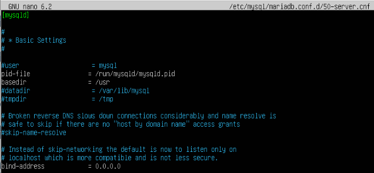
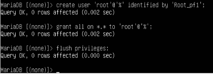
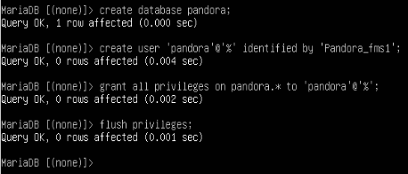
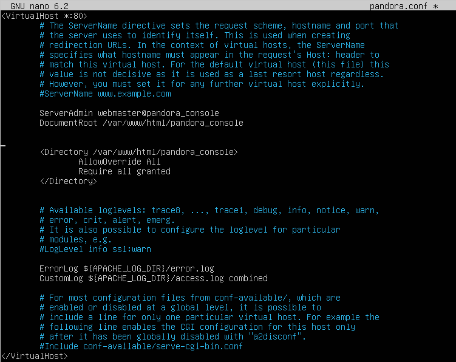
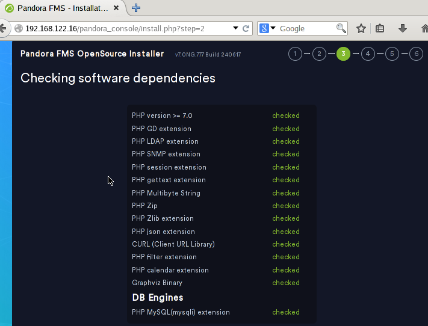

## Configuración del Ubuntu Server

### **Configuración del netplan**

```
sudo nano /etc/netplan/50-cloud-init.yaml
sudo netplan apply
```

### **Configuración de Pandora FMS**

1. **Instalación de depenencias:**
   
Tendremos que instalar las siguientes dependencias:

  - apache2
  - mariaDB
  - php

```
sudo apt install apache2 mariadb-server mariadb-client php
```


1. **Configuracion de seguridad de MySQL**

Para añadir seguridad a las base de datos, al acceso a mysql, etc. Vamos a ejecutar el siguiente comando donde podremos añadir una contraseña al usuario root y nos preguntará si hace una serie de cosas como quitar los usuarios anónimos, quitar el acceso a las base de datos de prueba y actualizar las tablas.

```
sudo mysql_secure_installation

Remove anonymous users? → y (yes)
Disallow root login remotely? → n (no)
Remove test database and access to it? → y (yes)
Reload privilege tables now? → y (yes)
```

*Nos preguntará también si queremos cambiar la contraseña de `root@localhost`, en mi caso yo le he puesto `root`. La podremos cambiar una vez entremos en mysql*


2. **Configuración de mariaDB**

Hay que tener en cuenta que vamos a acceder desde una máquina diferente al server,por lo que tenenmos que editar el archivo de configuración

Buscaremos la linea de `bind-address` y le pondremos `0.0.0.0`

```
sudo nano /etc/mysql/mariadb.conf.d/50-server.cnf

bind-address: 0.0.0.0
```




Ahora entraremos en mysql y crearemos, si no existe, el usuario root y le daremos permisos para que pueda hacerlo todo.

```
sudo mysql

create user ‘root’@’%’ identified with mysql_native_password by ‘Root_pf1’;
grant all on *.* to 'root'@'%';
flush privileges;
```




1. **Creación de la base de datos y el usuario**

Vamos a crear la base de datos y el usuario con el cuál accederemos desde el cliente

```
sudo mysql -u root -p

CREATE DATABASE pandora;
CREATE USER 'pandora'@'%' IDENTIFIED BY 'Pandora_fms1';
GRANT ALL PRIVILEGES ON pandora.* TO 'pandora'@'%';
FLUSH PRIVILEGES;
EXIT;
```




1. **Descarga e instalación de Pandora FMS**

Clonaremos el repositorio de github de pandora y damos permisos a este

```
git clone https://github.com/pandorafms/pandorafms.git
sudo mv pandorafms/pandora_console /var/www/html/pandora_console

sudo chown -R www-data:www-data /var/www/html/pandora_console
sudo chmod -R 755 /var/www/html/pandora_console
```


1. **Configuración de Apache**

Para ello creamos y editamos el archivo de configuración y lo habilitamos

```
sudo cp 000-default.conf pandora.conf
sudo nano pandora.conf

sudo a2ensite pandora.conf
sudo systemctl reload apache2
sudo systemctl restart apache2
sudo systemctl status apache2
```




1. **Finalizar instalacion en el navegador**

Una vez hecha la instalación y configuración de apache, podremos acceder a través de un navegador buscando lo siguiente:

```
http://192.168.122.16/pandora_console
```

Teniendo en cuenta que la dirección `192.168.122.16` es la ip del servidor y `pandora_console` la carpeta que hemos movido a `/var/www/html`


Una vez dentro simplemente seguimos los pasos de la instalación, nos indicará si hay alguna dependencia que no esté instalada.



Y nos preguntará acerca de los datos de la base de datos.


Cuando encuentre la base de datos se creará


1. **Instalación y configuración del serrvidor de Pandora FMS**


