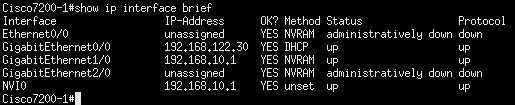
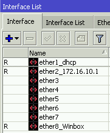
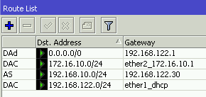
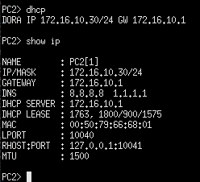

## Configuración de los routers

### Router Cisco

1. **Configuración de las interficies**

Primero configuraremos la interficie `g0/0` para que tenga IP por dhcp

```
config t
interface g0/0
no shutdown
ip address dhcp
ip nat outside
exit (X2)
write
copy run start
```

En la interficie `g1/0` la configuraremos con una IP estática
```
config t
interface g0/0
no shutdown
ip address 192.168.10.1 255.255.255.0
ip nat inside
exit (X2)
write
copy run start
```

Y ya tendriamos las dos interficies con IPs, para ver la configuración de las interficies y comprobar que lo hayamos hecho bien usaremos el siguiente comando:

```
show ip interface brief
```




2. **Configuración DHCP**

Vamos a crear un "POOL" ,que es el conjunto de direcciones que vamos a usar para asignarselas a los VPCs, y a configurarlo para que de las direcciones.

```
config t
ip dhcp pool POOL1
network 192.168.10.0 255.255.255.0
dns-server 8.8.8.8
default-router 192.168.10.1
exit
ip dhcp expluded-address 192.168.10.1 192.168.10.9
ip dhcp expluded-address 192.168.10.31 192.168.10.254
write
copy run start
```

Donde:

  - **network** --> es la direcion de red en la que vas a hacer el pool
  - **dns-server** --> resolucion de nombres
    - Yo he puesto el de google, si tienes uno propio puedes ponerlo
  - **default-router** --> es la direccion por la cual saldrán
    - en mi caso es la direccion `192.168.10.1`
  - **ip dhcp excluded-address** --> son las direcciones ip que **NO** vamos a asignar a los equipos
    - Yo queria asignar de la `192.168.10.10` a la `192.168.10.30` por lo que he excluido todas las demás


3. **Reserva de direcciones IP**

Para reservar direcciones IP tendremos que crear un pool y decirle cual es la ip que queremos asignar al igual que la dirección MAC del equipo al cual le asignaremos dicha dirección reservada.

```
config t
ip dhcp pool UbD
host 192.168.10.50 255.255.255.0
client-identifier 010c.bf1c.8700.00
default-router 192.168.10.1
dns-server 8.8.8.8
exit
copy run start
```

Donde:

  - **UbD** --> es el nombre que le asignamos al pool
  - **dns-server** --> resolucion de nombres
    - Yo he puesto el de google, si tienes uno propio puedes ponerlo
  - **default-router** --> es la dirección por la cual saldrán
    - en mi caso es la `192.168.10.1`
  - **host** --> es la dirección que queremos reservar para un equipo
    - Yo queria asignar de la `192.168.10.50` y la `192.168.10.60`
  - **client-identifier** --> es la dirección MAC con un `01` delante de esta y agrupada en 4, menos los 2 ultimos.


Haremos los mismos pasos para todos los equipos que queramos reservales direcciones. En mi caso yo lo queria para el Ubuntu Desktop y para el Windows 10.

```
config t
ip dhcp pool W10
host 192.168.10.60 255.255.255.0
client-identifier 010c.800f.2f00.00
default-router 192.168.10.1
dns-server 8.8.8.8
exit
copy run start
```


4. **Enrutamiento entre redes**

Vamos a indicarle al router cómo llegar a la red del otro router, vamos a ejecutar los siguientes comandos:

```
config t
ip route 172.16.10.0 255.255.255.0 192.168.122.212
exit
write
copy run start
```
Le estamos indicando al router que el tráfico que vaya a la red `172.16.10.0/24` debe entrar por la interfaz `192.168.122.212` (que es la interfaz del router mikrotik).


```
show ip route
```


5. **Comprobar la funcionalidad**

Una vez hayamos hecho todo esto ya tendriamos la configuración terminada.


Y cuando le digamos al VPC una direccion por dhcp nos dará una dentro del rango especificado. Además podrá hacerle ping al VPC2 sin problemas.


-------------------------------------------------------------------------------------

### Router Mikrotik

Antes de emepzar la configuración, me gusta ponerle nombre a las interfaces, ya que asi trabajo más rápida y cómodamente.
En el apartado de `Interfaces` podemos asignarles nombre.




1. **Configuración de las interficies**

Vamos a asignarle IPs a las interficies, veremos que la IP asignada por dhcp no va ha hacer falta configurarla, por lo que solo hará falta configurar la interficie `ether2`.

Iremos al apartado `IP > Addresses`


2. **Configuración DHCP**

Vamos al apartado `IP > DHCP Server` y en el botón de `DHCP Setup` podremos configurar el pool de direcciones, DNS, red, etc.

Para poder ver el pool de direcciones entraremos en el apartado `IP > Pool`


3. **Reserva de direcciones IP**

Para reservar direcciones IP tendremos entrar en `IP > DHCP Server > Leases`, aquí clicamos al `+` y especificamos la ip que queremos reservar y la MAC del equipo.


4. **Enrutamiento entre redes**

Vamos a indicarle al router cómo llegar a la red del otro router, entraremos en `IP > Routes` y agregaremos una nueva ruta especificando los siguiente:

```
Dst.Address   --> 192.168.10.0/24 
Gateway       --> 192.168.122.30
```



5. **NAT configuration**

Para poder salir a internet necesitamos configurar el nat, para ello iremos al apartado `IP > Firewall > NAT`, ahí clicaremos en el `+` y especificaremos lo siguiente:

```
chain         --> srcnat
Out.Interface --> ether1_dhcp (que es la interfaz por la que podemos salir a internet)
Action        --> masquerade
```


6. **Comprobar la funcionalidad**

Una vez terminada la configuración entraremos en el VPC2 y comprobaremos si nos asigna una IP por DHCP dentro del pool de direcciones que hemos especificado. Y además haremos ping al VPC1.




