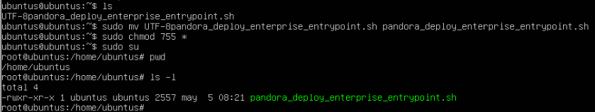
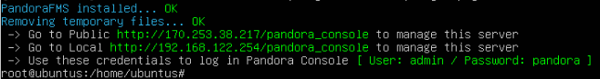

## Configuración del Ubuntu Server

### **Instalación de Pandora FMS**

1. **Obtener script**
   
Usando el siguiente comando obtendremos el script que nos instalará Pandora FMS

```
curl -SsL https://pfms.me/deployenterprise
```

2. **Instalación de PandoraFMS**

Antes de empezar con la instalación comentaremos la linea que se encuentra en `/etc/apt/source.list`


Una vez comentada la linea le daremos permisos al script 



Luego crearemos la variable `PANDORA_LTS` a la cual le asignaremos el valor de `1` y ejecutaremos el script desde `root`


3. **Finalizar instalacion en el navegador**

Una vez hecha la instalación nos aparecerá la ip con su usuario y contraseña para poder acceder a Pandora desde el navegador

```
http://192.168.122.254/pandora_console
```




### **Configuración de Pandora FMS**

1. **????**


