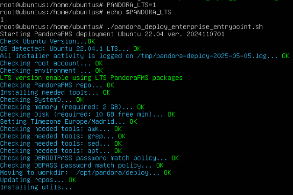

## Configuración del Ubuntu Server

### **Instalación de Pandora FMS**

1. **Obtener script**
   
Usando el siguiente comando obtendremos el script que nos instalará Pandora FMS

```
curl -SsL https://pfms.me/deployenterprise
```

2. **Instalación de PandoraFMS**

Antes de empezar con la instalación comentaremos la linea que se encuentra en `/etc/apt/source.list`


Una vez comentada la linea le daremos permisos al script 


Luego crearemos la variable `PANDORA_LTS` a la cual le asignaremos el valor de `1` y ejecutaremos el script desde `root`




3. **Finalizar instalacion en el navegador**

Una vez hecha la instalación nos aparecerá la ip con su usuario y contraseña para poder acceder a Pandora desde el navegador

```
http://192.168.122.254/pandora_console
```


### **Configuración de Pandora FMS**

1. **Creación de agentes**

Vamos a instalar en los clientes Ubuntu y Windows agentes para poder monitorizarlos.
Nos descargamos de la pagina oficial de pandora el paquete `pandorafms_one_agent_linux-latest.tar.gz`, lo descomprimimos, buscamos el paquete de `pandora_agent_installer` dentro de la carpeta `unix` y lo instalamos.

```
https://pandorafms.com/manual/!current/en/documentation/pandorafms/technical_annexes/32_pfms_install_software_agent

tar xvzf pandorafms_one_agent_linux-latest.tar.gz
cd unix/
./pandora_agent_installer --install
```


Una vez descomprimido e instalado editamos el fichero `/etc/pandorafms/pandora_agent.conf`, donde pondremos la ip del servidor de pandora.


 Iniciamos el agente y esperamos a que nos aparezca en nuestro Pandora.

```
sudo systemctl start pandora_agent_daemon
```


