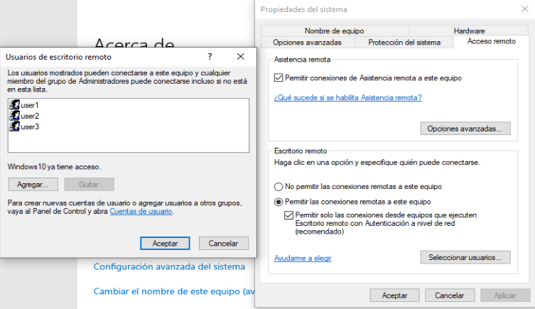
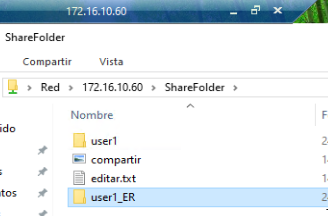
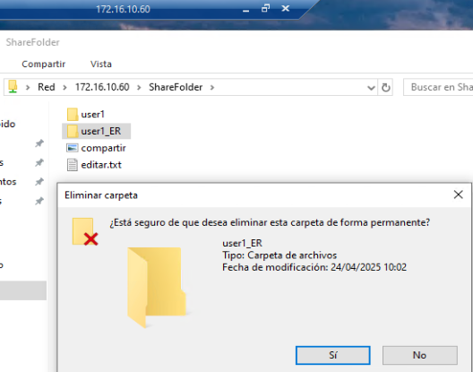
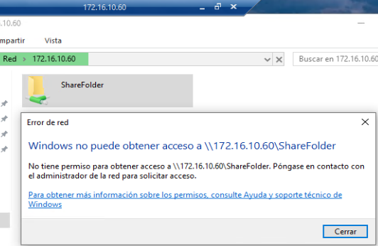

## Configuración del servicio de archivos


1. **Asignar el mismo grupo de trabajo**

Primero vamos a poenr los dos Windows 10 en el mismo grupo de trabajo, en mi caso lo he personalizado y los he puesto en `PF_MARINA`, iremos a:

```
Ajustes > Sistema > Acerca de > Cambiar el nombre del equipo (avanzado) > Cambiar

Grupo de trabajo:   PF_MARINA
```

Nos pedirá reiniciar el equipo y ya los tendremos a los dos dentro del mismo grupo de trabajo.


1. **Creación de la carpeta compartida**

Vamos a crear la carpeta que vamos a compartir en uno de los dos equipos. No importa en que equipo creemos la carpeta, yo por ejemplo la crearé en el equipo `Windows102` y añadiré unos documentos dentro de esta.


1. **Creación de usuarios**

Para poder hacer pruebas vamos a crear tres usuarios, los cuales tendrán diferentes permisos sobre la carpeta compartida.

- User1: Usuario1
- User2: Usuario2
- User3: Usuario3

Iremos a:

```
Administrador de equipos > Usuarios y grupos locales > Usuarios

Clic derecho > Usuario Nuevo
```

 


1. **Compartir la carpeta**

Ahora que tenemos la carpeta y los usuarios creados, vamos a compartir la carpeta y les asignaremos los siguientes permisos a los usuarios que hemos creado sobre la carpeta que vamos a compartir.

- User1: Usuario1
    - Lectura y escritura
- User2: Usuario2
    - Solo lectura
- User3: Usuario3
    - Denegaremos el acceso

Haremos lo siguiente en la carpeta

```
Clic derecho > Propiedades > Compartir > Uso compartido avanzado > Compartir esta carpeta

Clic derecho > Propiedades > Seguridad > Editar > Agregar
```


1. **Configuración del escritorio remoto**

En el equipo `Windows102` entraremos en `Ajustes > Sistema > Acerca de > Configuración Avanzada del sistema >  Acceso Remoto`, activaremos el acceso remoto y especificaremos que solo podremos acceder si nos logeamos desde los usuario `user1`, `user2` y `user3`




1. **Comprobar el funcionamiento**

Vamos a comprobar que funciona de diferentes formas, usando el escritorio remoto desde el equipo de `Windows101` nos logearemos con los 3 usuarios, desde el equipo `Windows101` intentaremos acceder a la carpeta y desde el propio equipo `Windoiws102` nos logearemos con los 3 usuarios.


```
Explorador de archivos > Red > \\172.16.10.60
```
Donde:

  - **\ \172.16.10.60** --> es la dirección IP del equipo donde se encuentra a carpeta compartida


**Desde el equipo de Windows102**

*User1*


*User2*


*User3*


**Desde el escritorio remoto del equipo de Windows101**

*User1*





*User2*





*User3*





**Desde el equipo de Windows101**


