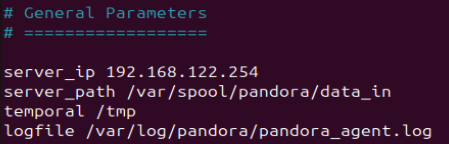
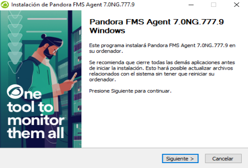
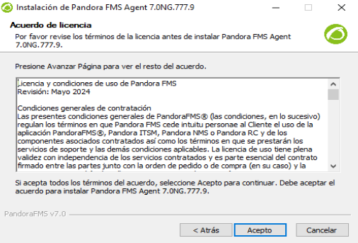
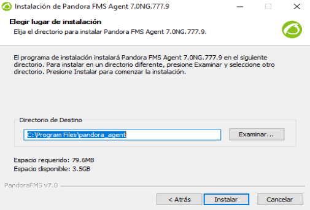
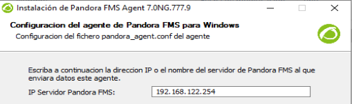
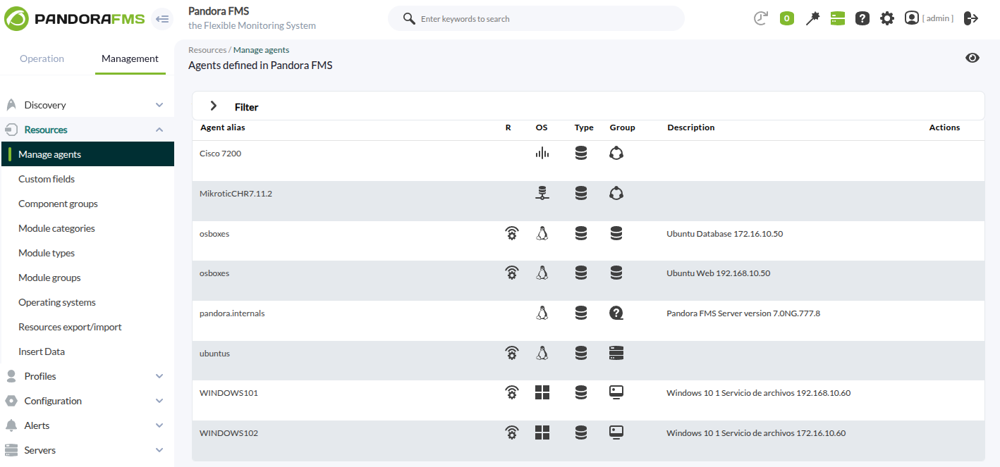

# **Creación  de agentes en Pandora FMS**

## Ubuntu
1. **Descarga e instalación**

Nos descargamos de la pagina oficial de pandora el paquete `pandorafms_one_agent_linux-latest.tar.gz`, lo descomprimimos, buscamos el paquete de `pandora_agent_installer` dentro de la carpeta `unix` y lo instalamos.

```
https://pandorafms.com/manual/!current/en/documentation/pandorafms/technical_annexes/32_pfms_install_software_agent

tar xvzf pandorafms_one_agent_linux-latest.tar.gz
cd unix/
./pandora_agent_installer --install
```


2. **Configuración del servidor**

Una vez descomprimido e instalado editamos el fichero `/etc/pandorafms/pandora_agent.conf`, donde pondremos la ip del servidor de pandora.





Iniciamos el agente y esperamos a que nos aparezca en nuestro Pandora.

```
sudo systemctl start pandora_agent_daemon
```


## Windows
1. **Descarga e instalación**

Nos descargamos de la pagina oficial de pandora el paquete `Pandorafms_one_agent_Windows-lts.x86_64.exe`, ejecutamos el `.exe` y seguimos la instalación.











1. **Configuración del servidor**

Una vez instalado, para asegurarnos de que está activado ejecutaremos el siguiente comando en powershell.

```
NET START PandoraFMSAgent
```


3. **Agentes instalados**

Ya tendriamos los agentes en pandora FMS

