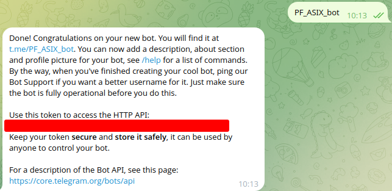
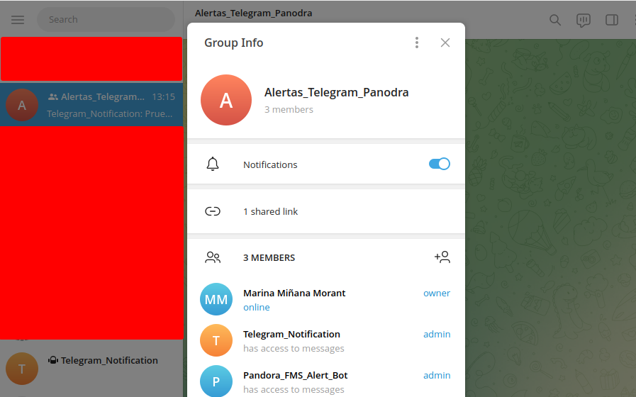
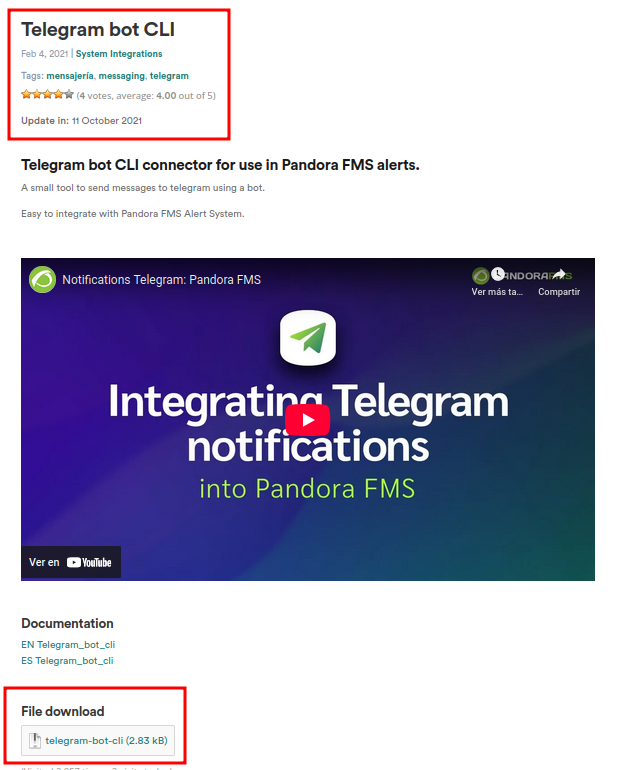
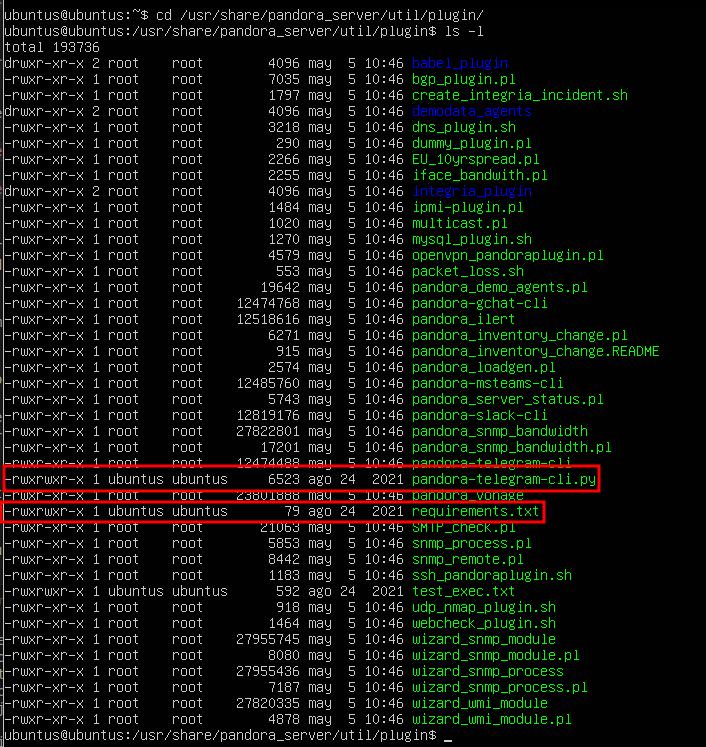
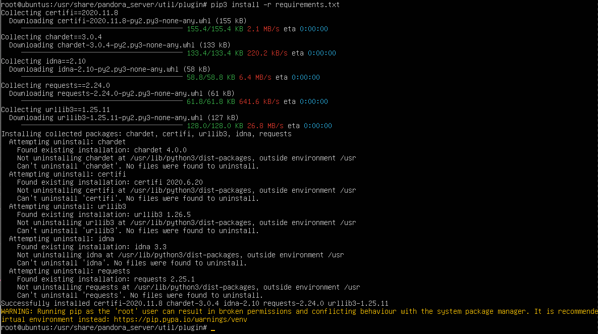
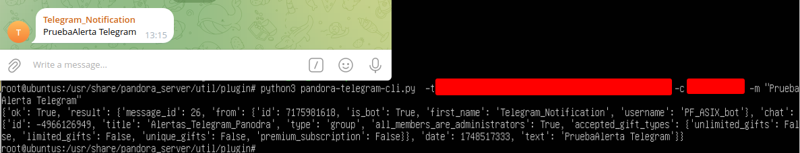
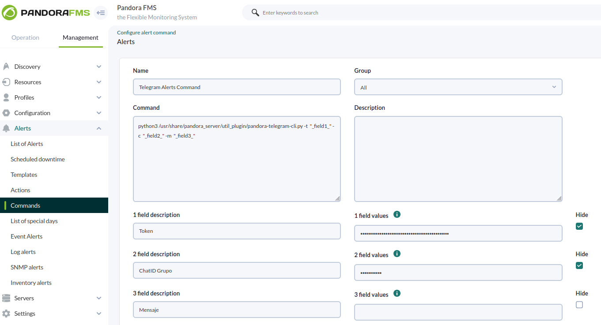
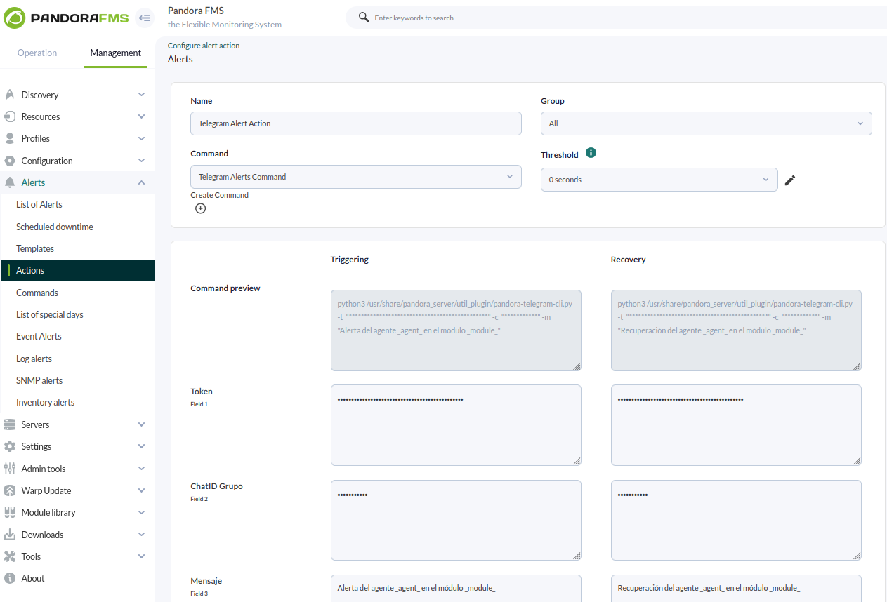

# Sistema de alertas con Telegram

## Bot & Configuración en el server

### Creación del bot de Telegram

Lo primero que debemos hacer es crearnos un bot en telegram.

Usaremos "@botfather" para hacer la creación, donde nos dará el token.



Luego crearemos un grupo con dicho bot, de ahí sacaremos el chatID del grupo para que nos envie los mensajes a ese grupo.




### Configuración del servidor

Una vez creado el grupo de Telegram pasaremos descargarnos un paquete de la libreria oficial de pandora que nos permitirá enviar mensajes.





Descomprimimos el paquete, le damos permisos de ejecución y lo ponemos dentro de la ruta `/usr/share/pandora_server/utils/pluggin`

```
sudo chmod +x *
```



Antes de seguir, nos harán falta python3 y python3-pip para poder instalar lo que que necesitamos para seguir adelante.

```
sudo apt install python3 python3-pip
```

Ahora que ya tenemos las herramientas que necesitamos nos posicionamos en la ruta donde hemos dejado los paquetes desmcomprimidos e instalamos el paquete de `requirements.txt`

```
cd /usr/share/pandora_server/utils/pluggin

sudo su --> necesitaremos los permisos de root para hacerlo

pip3 install requirements.txt
```




### Prueba del mensaje a Telegram

Ejecutaremos el siguiente comando para comprobar que podemos recibir mensajes en el grupo de Telegram que hemos creado.

```
pyhton3 pandora-telegram-cli.py -t *TOKEN* -c *CHATID* -m *"MENSAJE"*
```




## Pandora

### Configuración de la alerta

Una vez comprobado que se pueden enviar mensajes vamos a crear el comando dentro de la interfaz gráfica de Pandora para poder usarlo.

Donde  añadiremos el comando que hemos usado anteriormente pero sustetuyendo por campos que más abajo, en fields, rellenaremos con al ifnormación necesaria.

`Management > Alerts > Commands`




Después configuraremos la acción, donde enlazaremos la acción al comando que hemos creado y añadiremos el mensaje que queremos recibir.

`Management > Alerts > Actions`




