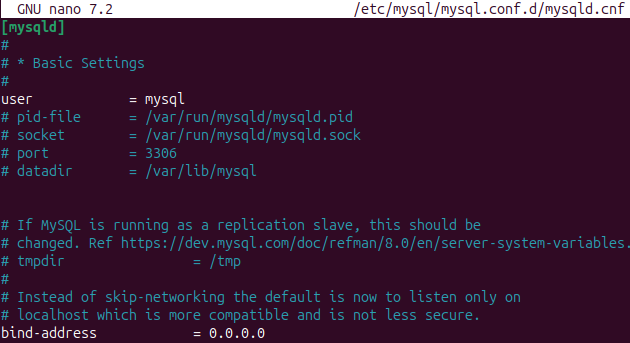
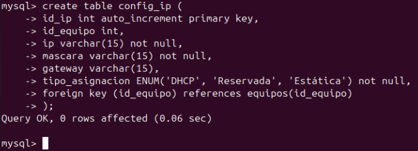
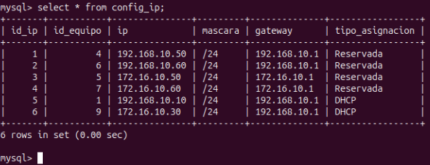

## Configuración del servidor MySQL

1. **Entidad-Relación de la base de datos**


2. **Instalación de mysql**

```
sudo apt update
sudo apt install mysql-server
```

3. **Archivo de configuración**

Vamos a editar el archivo de configuración para que se pueda acceder desde las demás máquinas. Accedemos a él, buscamos la linea de `bind-address` y la cambiamos la dirección IP a `0.0.0.0`
```
sudo nano /etc/mysql/mysql.conf.d/mysqld.cnf

bind-address  = 0.0.0.0
```




4. **Creación de la base de datos**

Vamos a entrar en mysql a través de la terminal, crearemos la base de datos y las tablas.

```
sudo mysql

CREATE DATABASE IF NOT EXISTS proyecto_final;
USE proyecto_final;
```


```
CREATE TABLE nombre_tabla (
    columnas tipo esp,
    columnas tipo esp
);
```

Donde:

  - **nombre_tabla** --> es el nombre que le asignaremos a la tabla que crearemos
  - **columnas** --> el nombre que tendrá la columna
  - **tipo** --> el tipo de información que habrá
    - Ejemplo: INT, Varchar, etc
  - **esp** --> si es primary key, not null, auto_increment, etc
    - no es necesario poner siempre algo, es decir, si es una clave primaria lo especificaremos, pero en caso de que no fuera clave primaria o pudiera ser nulo (por ejemplo), no haría falta especificar nada.





5. **Inserción de la información**

Una vez que tengamos las tablas creadas podremos poner la información en estas.

```
INSERT INTO nombre_tabla (nombre_columna, nombre_columna, nombre_columna) VALUES
(X,"X", "X"),
(X,"X", "X");
```

Donde:

  - **nombre_tabla** --> es el nombre de una de las tablas creadas
  - **nombre_columna** --> es el nombre de la/s columna/s en las que añadiremos información
  - **X** --> es la información que especificaremos
    - habrá tantas `X` como columnas haya
    - los numeros se especificarán sin comillas
    - las palabras se especificarán con comillas


6. **Comprobar el funcionamiento**

Para ver lo que hemos hecho vamos a hacer unas consultas a las tablas 

- Listar todo de una tabla en específico

```
select * from tabla;
```

Donde:

- **tabla** --> es el nombre de la tabla que queremos ver


