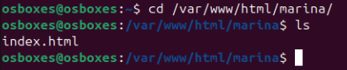
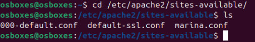
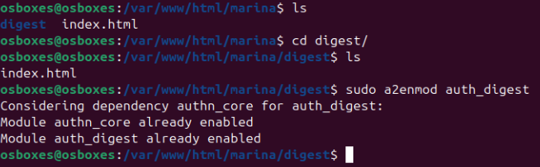
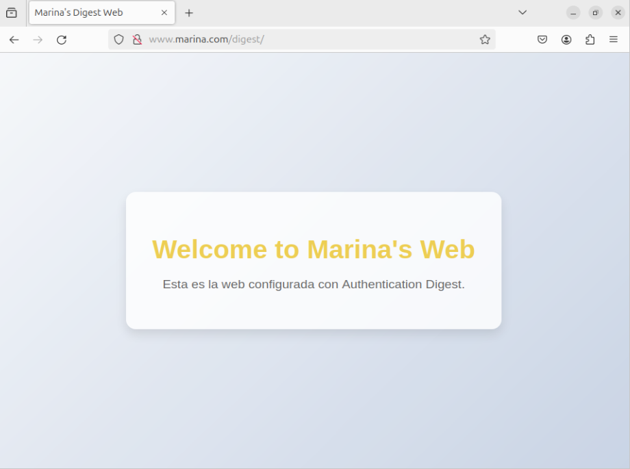

## Configuración del servidor web

1. **Instalación de apache**

```
sudo apt update
sudo apt install apache2
```

2. **Creación del index.html**

Primero crearemos una carpeta en el directorio `/var/www/html` para tener el archivo `index.html` donde editaremos a nuestro gusto la página web sin equivocarnos de índice.

```
cd /var/www/html
sudo mkdir marina
cd marina
sudo nano index.html
```




3. **Creación del archivo de configuración**

Ahora crearemos y editaremos el archivo de configuración.

```
cd /etc/apache2/sites-available
sudo cp 000-default.conf marina.conf
sudo nano marina.conf
```




Una vez creado y editado el archivo de configuración, habilitamos la pàgina web

```
cd /etc/apache2/sites-available
sudo a2ensite marina.conf
```


Antes de poder acceder a ella por el nombre que le hemos dado, en este caso `www.marina.com` debemos hacer al equipo que la propia máquina pueda resolver el nombre, esto lo especificaremos en `/etc/hosts`

```
sudo nano /etc/hosts

192.168.10.50 www.marina.com
```

Donde:

  - **192.168.10.50** --> es la ip de la propia máquina
  - **www.marina.com** --> el nombre que buscaremos en el navegador


1. **Comprobar el funcionamiento**
Ahora que ya está configurado vamos a entrar en el navegador y a buscar nuesra página web


### Configuración Auth Digest

1. **Creación del index y habilitar el modulo**

Primero crearemos una carpeta llamada `digest` dentro de la carpeta que teniamos anterirmente creada. Dentro de esta crearemos el `index.html` y lo editaremos.


```
sudo mkdir digest
sudo nano index.html
```

También habilitaremos el modulo que se necesita para poder configurar el auth digest.
Y seguidamente reiniciaremos el servidcio de apache.

```
sudo a2enmod auth_digest
```




2. **Creación del archivo de contraseñas**

Vamos a crear el archivo donde pondremos las contraseñas de auth digest.

```
sudo mkdir /etc/apache/digestpasswd
cd /etc/apache2/digestpasswd 
sudo touch passdigest
```

Una vez creado vamos a usar el siguiente comando para añadir el usuario `proyecto` con contraseña `final`.

```
cd /etc/apache2/digestpasswd

sudo htdigest -c  access proyecto
```


1. **Archivo de configuración**

En el archivo de configuración (el que tenemos ya creado y habilitado), tendremos que añadir las siguientes lineas

```
<Directory "/var/www/html/marina/digest">
    AuthType Digest
    AuthName "access"
    AuthDigestProvider file
    AuthFile "/etc/apache2/digestpasswd/passdigest"
    Require valid-user
</Directory>
```


1. **Comprobar el funcionamiento**

Entraremos en el navegador, buscaremos la pagina web pero con una barra y el nombre de la carpeta que hemos creado:

```
http://www.marina.com/digest
```




