# Projecte Final: Monitorización de Red y Servicios con Pandora FMS en GNS3

## Estructura del Escenario en GNS3

### Dispositivos y Red
**NAT**

**Ubuntu Server (Servidor DHCP)**:
  
  - Pandora FMS


**Routers**
  
  - Cisco
  - Asignar direcciones IP:
    - **Xarxa 1**: `192.168.10.0/24`.
  - Mikrotik
  - Asignar direcciones IP:
    - **Xarxa 2**: `172.16.10.0/24`.


**Switch 1**:
  
  - Dispositivos conectados:
    - Firefox (IP asignada por DHCP).
    - VPC (IP asignada por DHCP).
    - Ubuntu Desktop (IP reservada: `192.168.10.50`, servidor web).
    - Windows 10 (IP reservada: `192.168.10.60`, servicio de archivos).


**Switch 2**:
  
  - Dispositivos conectados:
    - Firefox (IP asignada por DHCP).
    - VPC (IP asignada por DHCP).
    - Ubuntu Desktop (IP reservada: `172.16.10.50`, servidor MySQL).
    - Windows 10 (IP reservada: `172.16.10.60`, servicio de archivos).

<!-- foto de la estructura -->

-------------------------------------------------------------------------------------

## Configuración del Ubuntu Server

### **Configuración del netplan**

```
sudo nano /etc/netplan/50-cloud-init.yaml
sudo netplan apply
```

### **Configuración de Pandora FMS**

1. **Instalación de depenencias:**
   
  - apache2
  - mariaDB
  - php

```
sudo apt install apache2 mariadb-server mariadb-client php
```

2. **Configuración de mariaDB**

Hay que tener en cuenta que vamos a acceder desde una máquina diferente al server,por lo que tenenmos que editar el archivo de configuración

Buscaremos la linea de `bind-address` y le pondremos `0.0.0.0`
```
sudo nano /etc/mysql/mariadb.conf.d/50-server.cnf

bind-address: 0.0.0.0
```

3. **Creación de la base de datos y el usuario**

Vamos a crear la base de datos y el usuario con el cuál accederemos desde el cliente

```
sudo mysql -u root -p

CREATE DATABASE pandora;
CREATE USER 'pandora'@'%' IDENTIFIED BY 'tu_password_segura';
GRANT ALL PRIVILEGES ON pandora.* TO 'pandora'@'%';
FLUSH PRIVILEGES;
EXIT;
```

4. **Descarga e instalación de Pandora FMS**

Para ello he clonado el repositorio que github de pandora y dado permisos a este

```
git clone https://github.com/pandorafms/pandorafms.git
sudo mv pandorafms/pandora_console /var/www/html/pandora_console

sudo chown -R www-data:www-data /var/www/html/pandora_console
sudo chmod -R 755 /var/www/html/pandora_console
```

5. **Configuración de Apache**

Para ello creamos y editamos el archivo de configuración y lo habilitamos

```
sudo cp 000-default.conf pandora.conf
sudo nano pandora.conf

sudo a2ensite pandira.conf
sudo systemctl reload apache2
sudo systemctl restart apache2
sudo systemctl status apache2
```
6. **Finalizar instalacion en el navegador**

Una vez hecha la instalación y configuración de apache, podremos acceder a través de un navegador buscando lo siguiente:

```
http://192.168.122.16/pandora_console
```

Teniendo en cuenta que la dirección `192.168.122.16` es la ip del servidor y `pandora_console` la carpeta que hemos movido a `/var/www/html`


Una vez dentro simplemente seguimos los pasos de la instalación, nos indicará si hay alguna dependencia que no esté instalada.

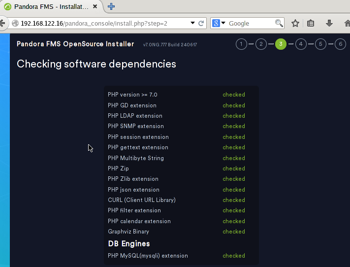

Y nos preguntará acerca de los datos de la base de datos.


Cuando encuentre la base de datos se instalará


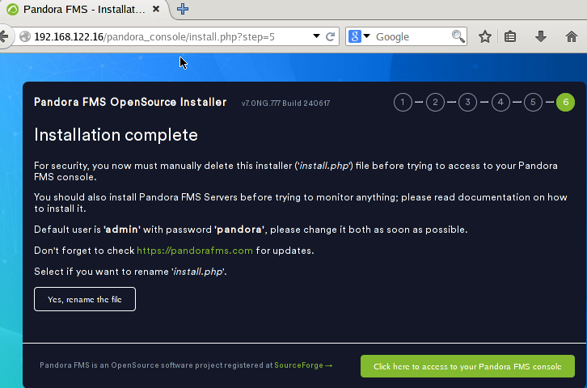

Al volver al servidor y entrar en la carpeta de `pandora_console` veremos el archivo `install.php` que se ha creado con la instalación, este habrá que eliminarlo

```
cd /var/www/html/pandora_console
sudo rm install.php
```
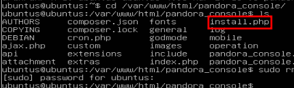


1. **Instalación y configuración del serrvidor de Pandora FMS**


-------------------------------------------------------------------------------------

## Configuración de los routers

### Router Cisco

1. **Configuración de las interficies**

Primero configuraremos la interficie `g0/0` para que tenga IP por dhcp

```
config t
interface g0/0
no shutdown
ip address dhcp
ip nat outside
exit (X2)
write
```

En la interficie `g1/0` la configuraremos con una IP estática
```
config t
interface g0/0
no shutdown
ip address 192.168.10.2 255.255.255.0
ip nat inside
exit (X2)
write
```

Y ya tendriamos las dos interficies con IPs, para ver la configuración de las interficies y comprobar que lo hayamos hecho bien usaremos el siguiente comando:

```
show ip interface brief
```
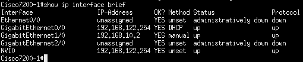

2. **Configuración DHCP**

Vamos a crear un "POOL" ,que es el conjunto de direcciones que vamos a usar para asignarselas a los VPCs, y a configurarlo para que de las direcciones.

```
config t
ip dhcp pool POOL1
network 192.168.10.0 255.255.255.0
dns-server 8.8.8.8
default-router 192.168.10.2
exit
ip dhcp expluded-address 192.168.10.3 192.168.10.9
ip dhcp expluded-address 192.168.10.31 192.168.10.254
```

Donde:

  - **network** --> es la direcion de red en la que vas a hacer el pool
  - **dns-server** --> resolucion de nombre
    - Yo he puesto el de google, si tienes uno propio puedes ponerlo
  - **default-router** --> es la direccion por la cual saldrán en caso de ir a internet
    - en mi caso es la direccion `192.168.10.2` pero puede ser cualquier otra que tu hayas asignado.
  - **ip dhcp excluded-address** --> son las direcciones ip que **NO** vamos a asignar a los equipos
    - Yo queria asignar de la `192.168.10.10` a la `192.168.10.30` por lo que he excluido todas las demás


3. **Comprobar la funcionalidad**

Una vez hayamos hecho todo esto ya tendriamos la configuración terminada.


Y cuando le digamos al VPC una direccion por dhcp nos dará una dentro del rango especificado.

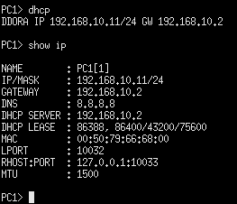


4. **Enrutamiento entre redes**


-------------------------------------------------------------------------------------

### Router Mikrotik

Antes de emepzar la configuración, me gusta ponerle nombre a las interfaces, ya que asi trabajo más rápida y cómodamente.
En el apartado de `Interfaces` podemos asignarles nombre.

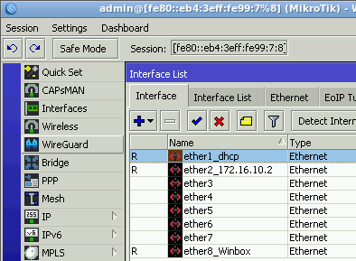

1. **Configuración de las interficies**

Vamos a asignarle IPs a las interficies, veremos que la IP asignada por dhcp no va ha hacer falta configurarla, por lo que solo hará falta configurar la interficie `ether2`.

Iremos al apartado `IP > Addresses`

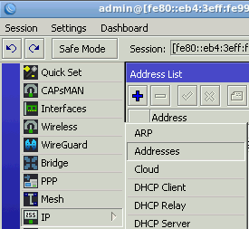

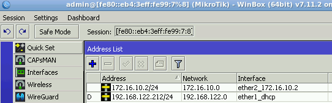

1. **Configuración DHCP**

Vamos al apartado `IP > DHCP Server` y en el botón de `DHCP Setup` podremos configurar el pool de direcciones, DNS, red, etc.

Para poder ver el pool de direcciones entraremos en el apartado `IP > Pool`

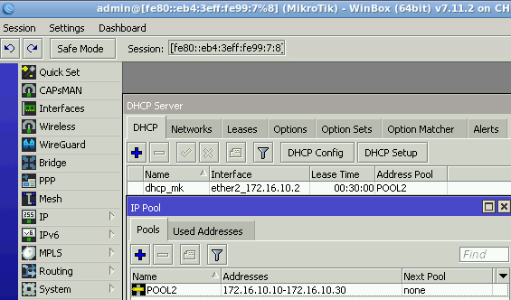


3. **NAT configuration**

Para poder salir a internet necesitamos configurar el nat, para ello iremos al apartado `IP > Firewall > NAT`, ahí clicaremos en el `+` y especificaremos lo siguiente:

```
chain         --> srcnat
Out.Interface --> ether1_dhcp (que es la interfaz por la que podemos salir a internet)
Action        --> masquerade
```
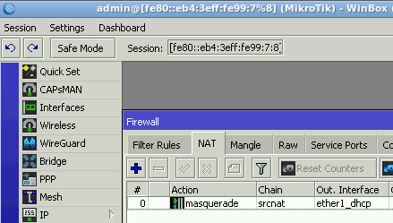


4. **Comprobar la funcionalidad**

Una vez terminada la configuración entraremos en el VPC2 y comprobaremos si nos asigna una IP por DHCP dentro del pool de direcciones que hemos especificado.

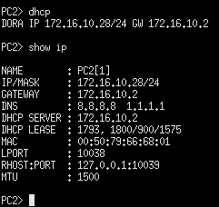


5. **Enrutamiento entre redes**


