# Projecte Final: Monitorización de Red y Servicios con Pandora FMS en GNS3

## Estructura del Escenario en GNS3

### Dispositivos y Red
**NAT**

**Ubuntu Server (Servidor DHCP)**:
  
  - Pandora FMS


**Routers**
  
  - Cisco
  - Asignar direcciones IP:
    - **Xarxa 1**: `192.168.10.0/24`.
  - Mikrotik
  - Asignar direcciones IP:
    - **Xarxa 2**: `172.16.10.0/24`.


**Switch 1**:
  
  - Dispositivos conectados:
    - Firefox (IP asignada por DHCP).
    - VPC (IP asignada por DHCP).
    - Ubuntu Desktop (IP reservada: `192.168.10.50`, servidor web).
    - Windows 10 (IP reservada: `192.168.10.60`, servicio de archivos).


**Switch 2**:
  
  - Dispositivos conectados:
    - Firefox (IP asignada por DHCP).
    - VPC (IP asignada por DHCP).
    - Ubuntu Desktop (IP reservada: `172.16.10.50`, servidor MySQL).
    - Windows 10 (IP reservada: `172.16.10.60`, servicio de archivos).

*FOTOOOOOOOOOOOOOOOOOOOOOOOOOOOOOOOOOOOO*

-------------------------------------------------------------------------------------

## Configuración del Ubuntu Server

### **Configuración del netplan**

```
sudo nano /etc/netplan/50-cloud-init.yaml
sudo netplan apply
```

### **Configuración de Pandora FMS**

1. **Instalación de depenencias:**
   
Tendremos que instalar las siguientes dependencias:

  - apache2
  - mariaDB
  - php

```
sudo apt install apache2 mariadb-server mariadb-client php
```


1. **Configuracion de seguridad de MySQL**

Para añadir seguridad a las base de datos, al acceso a mysql, etc. Vamos a ejecutar el siguiente comando donde podremos añadir una contraseña al usuario root y nos preguntará si hace una serie de cosas como quitar los usuarios anónimos, quitar el acceso a las base de datos de prueba y actualizar las tablas.

```
sudo mysql_secure_installation

Remove anonymous users? → y (yes)
Disallow root login remotely? → n (no)
Remove test database and access to it? → y (yes)
Reload privilege tables now? → y (yes)
```

*Nos preguntará también si queremos cambiar la contraseña de `root@localhost`, en mi caso yo le he puesto `root`. La podremos cambiar una vez entremos en mysql*


2. **Configuración de mariaDB**

Hay que tener en cuenta que vamos a acceder desde una máquina diferente al server,por lo que tenenmos que editar el archivo de configuración

Buscaremos la linea de `bind-address` y le pondremos `0.0.0.0`

```
sudo nano /etc/mysql/mariadb.conf.d/50-server.cnf

bind-address: 0.0.0.0
```


Ahora entraremos en mysql y crearemos, si no existe, el usuario root y le daremos permisos para que pueda hacerlo todo.

```
sudo mysql

create user ‘root’@’%’ identified with mysql_native_password by ‘Root_pf1’;
grant all on *.* to 'root'@'%';
flush privileges;
```

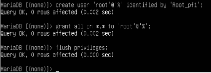


1. **Creación de la base de datos y el usuario**

Vamos a crear la base de datos y el usuario con el cuál accederemos desde el cliente

```
sudo mysql -u root -p

CREATE DATABASE pandora;
CREATE USER 'pandora'@'%' IDENTIFIED BY 'Pandora_fms1';
GRANT ALL PRIVILEGES ON pandora.* TO 'pandora'@'%';
FLUSH PRIVILEGES;
EXIT;
```

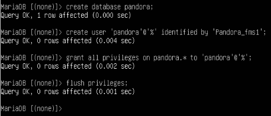


1. **Descarga e instalación de Pandora FMS**

Clonaremos el repositorio de github de pandora y damos permisos a este

```
git clone https://github.com/pandorafms/pandorafms.git
sudo mv pandorafms/pandora_console /var/www/html/pandora_console

sudo chown -R www-data:www-data /var/www/html/pandora_console
sudo chmod -R 755 /var/www/html/pandora_console
```


1. **Configuración de Apache**

Para ello creamos y editamos el archivo de configuración y lo habilitamos

```
sudo cp 000-default.conf pandora.conf
sudo nano pandora.conf

sudo a2ensite pandora.conf
sudo systemctl reload apache2
sudo systemctl restart apache2
sudo systemctl status apache2
```


1. **Finalizar instalacion en el navegador**

Una vez hecha la instalación y configuración de apache, podremos acceder a través de un navegador buscando lo siguiente:

```
http://192.168.122.16/pandora_console
```

Teniendo en cuenta que la dirección `192.168.122.16` es la ip del servidor y `pandora_console` la carpeta que hemos movido a `/var/www/html`


Una vez dentro simplemente seguimos los pasos de la instalación, nos indicará si hay alguna dependencia que no esté instalada.


Y nos preguntará acerca de los datos de la base de datos.


Cuando encuentre la base de datos se instalará


1. **Instalación y configuración del serrvidor de Pandora FMS**


-------------------------------------------------------------------------------------

## Configuración de los routers

### Router Cisco

1. **Configuración de las interficies**

Primero configuraremos la interficie `g0/0` para que tenga IP por dhcp

```
config t
interface g0/0
no shutdown
ip address dhcp
ip nat outside
exit (X2)
write
copy run start
```

En la interficie `g1/0` la configuraremos con una IP estática
```
config t
interface g0/0
no shutdown
ip address 192.168.10.1 255.255.255.0
ip nat inside
exit (X2)
write
copy run start
```

Y ya tendriamos las dos interficies con IPs, para ver la configuración de las interficies y comprobar que lo hayamos hecho bien usaremos el siguiente comando:

```
show ip interface brief
```


2. **Configuración DHCP**

Vamos a crear un "POOL" ,que es el conjunto de direcciones que vamos a usar para asignarselas a los VPCs, y a configurarlo para que de las direcciones.

```
config t
ip dhcp pool POOL1
network 192.168.10.0 255.255.255.0
dns-server 8.8.8.8
default-router 192.168.10.1
exit
ip dhcp expluded-address 192.168.10.1 192.168.10.9
ip dhcp expluded-address 192.168.10.31 192.168.10.254
write
copy run start
```

Donde:

  - **network** --> es la direcion de red en la que vas a hacer el pool
  - **dns-server** --> resolucion de nombres
    - Yo he puesto el de google, si tienes uno propio puedes ponerlo
  - **default-router** --> es la direccion por la cual saldrán
    - en mi caso es la direccion `192.168.10.1`
  - **ip dhcp excluded-address** --> son las direcciones ip que **NO** vamos a asignar a los equipos
    - Yo queria asignar de la `192.168.10.10` a la `192.168.10.30` por lo que he excluido todas las demás


3. **Reserva de direcciones IP**

Para reservar direcciones IP tendremos que crear un pool y decirle cual es la ip que queremos asignar al igual que la dirección MAC del equipo al cual le asignaremos dicha dirección reservada.

```
config t
ip dhcp pool UbD
host 192.168.10.50 255.255.255.0
client-identifier 010c.bf1c.8700.00
default-router 192.168.10.1
dns-server 8.8.8.8
exit
copy run start
```

Donde:

  - **UbD** --> es el nombre que le asignamos al pool
  - **dns-server** --> resolucion de nombres
    - Yo he puesto el de google, si tienes uno propio puedes ponerlo
  - **default-router** --> es la dirección por la cual saldrán
    - en mi caso es la `192.168.10.1`
  - **host** --> es la dirección que queremos reservar para un equipo
    - Yo queria asignar de la `192.168.10.50` y la `192.168.10.60`
  - **client-identifier** --> es la dirección MAC con un `01` delante de esta y agrupada en 4, menos los 2 ultimos.


Haremos los mismos pasos para todos los equipos que queramos reservales direcciones. En mi caso yo lo queria para el Ubuntu Desktop y para el Windows 10.

```
config t
ip dhcp pool W11
host 192.168.10.60 255.255.255.0
client-identifier 010c.800f.2f00.00
default-router 192.168.10.1
dns-server 8.8.8.8
exit
copy run start
```


1. **Enrutamiento entre redes**

Vamos a indicarle al router cómo llegar a la red del otro router, vamos a ejecutar los siguientes comandos:

```
config t
ip route 172.16.10.0 255.255.255.0 192.168.122.212
exit
write
copy run start
```
Le estamos indicando al router que el tráfico que vaya a la red `172.16.10.0/24` debe entrar por la interfaz `192.168.122.212` (que es la interfaz del router mikrotik).


```
show ip route
```

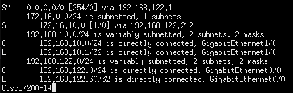


1. **Comprobar la funcionalidad**

Una vez hayamos hecho todo esto ya tendriamos la configuración terminada.


Y cuando le digamos al VPC una direccion por dhcp nos dará una dentro del rango especificado. Además podrá hacerle ping al VPC2 sin problemas.

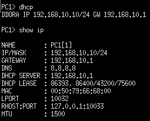

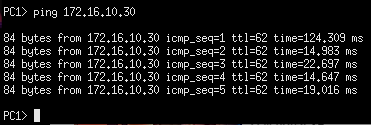


-------------------------------------------------------------------------------------

### Router Mikrotik

Antes de emepzar la configuración, me gusta ponerle nombre a las interfaces, ya que asi trabajo más rápida y cómodamente.
En el apartado de `Interfaces` podemos asignarles nombre.


1. **Configuración de las interficies**

Vamos a asignarle IPs a las interficies, veremos que la IP asignada por dhcp no va ha hacer falta configurarla, por lo que solo hará falta configurar la interficie `ether2`.

Iremos al apartado `IP > Addresses`


1. **Configuración DHCP**

Vamos al apartado `IP > DHCP Server` y en el botón de `DHCP Setup` podremos configurar el pool de direcciones, DNS, red, etc.

Para poder ver el pool de direcciones entraremos en el apartado `IP > Pool`

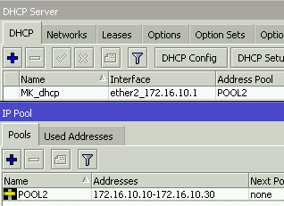


3. **Reserva de direcciones IP**

Para reservar direcciones IP tendremos entrar en `IP > DHCP Server > Leases`, aquí clicamos al `+` y especificamos la ip que queremos reservar y la MAC del equipo.


1. **Enrutamiento entre redes**

Vamos a indicarle al router cómo llegar a la red del otro router, entraremos en `IP > Routes` y agregaremos una nueva ruta especificando los siguiente:

```
Dst.Address   --> 192.168.10.0/24 
Gateway       --> 192.168.122.30
```


5. **NAT configuration**

Para poder salir a internet necesitamos configurar el nat, para ello iremos al apartado `IP > Firewall > NAT`, ahí clicaremos en el `+` y especificaremos lo siguiente:

```
chain         --> srcnat
Out.Interface --> ether1_dhcp (que es la interfaz por la que podemos salir a internet)
Action        --> masquerade
```


6. **Comprobar la funcionalidad**

Una vez terminada la configuración entraremos en el VPC2 y comprobaremos si nos asigna una IP por DHCP dentro del pool de direcciones que hemos especificado. Y además haremos ping al VPC1.


-------------------------------------------------------------------------------------

## Configuración del servidor web

1. **Instalación de apache**

```
sudo apt update
sudo apt install apache2
```

2. **Creación del index.html**

Primero crearemos una carpeta en el directorio `/var/www/html` para tener el archivo `index.html` donde editaremos a nuestro gusto la página web sin equivocarnos de índice.

```
cd /var/www/html
sudo mkdir marina
cd marina
sudo nano index.html
```


3. **Creación del archivo de configuración**

Ahora crearemos y editaremos el archivo de configuración.

```
cd /etc/apache2/sites-available
sudo cp 000-default.conf marina.conf
sudo nano marina.conf
```


Una vez creado y editado el archivo de configuración, habilitamos la pàgina web

```
cd /etc/apache2/sites-available
sudo a2ensite marina.conf
```


Antes de poder acceder a ella por el nombre que le hemos dado, en este caso `www.marina.com` debemos hacer al equipo que la propia máquina pueda resolver el nombre, esto lo especificaremos en `/etc/hosts`

```
sudo nano /etc/hosts

192.168.10.50 www.marina.com
```

Donde:

  - **192.168.10.50** --> es la ip de la propia máquina
  - **www.marina.com** --> el nombre que buscaremos en el navegador


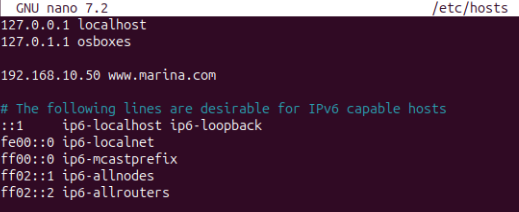


1. **Comprobar el funcionamiento**
Ahora que ya está configurado vamos a entrar en el navegador y a buscar nuesra página web


### Configuración Auth Digest

1. **Creación del index y habilitar el modulo**

Primero crearemos una carpeta llamada `digest` dentro de la carpeta que teniamos anterirmente creada. Dentro de esta crearemos el `index.html` y lo editaremos.


```
sudo mkdir digest
sudo nano index.html
```

También habilitaremos el modulo que se necesita para poder configurar el auth digest.
Y seguidamente reiniciaremos el servidcio de apache.

```
sudo a2enmod auth_digest
```


2. **Creación del archivo de contraseñas**

Vamos a crear el archivo donde pondremos las contraseñas de auth digest.

```
sudo mkdir /etc/apache/digestpasswd
cd /etc/apache2/digestpasswd 
sudo touch passdigest
```

Una vez creado vamos a usar el siguiente comando para añadir el usuario `proyecto` con contraseña `final`.

```
cd /etc/apache2/digestpasswd

sudo htdigest -c  access proyecto
```


1. **Archivo de configuración**

En el archivo de configuración (el que tenemos ya creado y habilitado), tendremos que añadir las siguientes lineas

```
<Directory "/var/www/html/marina/digest">
    AuthType Digest
    AuthName "access"
    AuthDigestProvider file
    AuthFile "/etc/apache2/digestpasswd/passdigest"
    Require valid-user
</Directory>
```


1. **Comprobar el funcionamiento**

Entraremos en el navegador, buscaremos la pagina web pero con una barra y el nombre de la carpeta que hemos creado:

```
http://www.marina.com/digest
```


-------------------------------------------------------------------------------------

## Configuración del servidor MySQL

1. **Instalación de mysql**

```
sudo apt update
sudo apt install mysql-server
```

2. **Archivo de configuración**

Vamos a editar el archivo de configuración para que se pueda acceder desde las demás máquinas. Accedemos a él, buscamos la linea de `bind-address` y la cambiamos la dirección IP a `0.0.0.0`
```
sudo nano /etc/mysql/mysql.conf.d/mysqld.cnf

bind-address  = 0.0.0.0
```


3. **Creación de la base de datos**

Vamos a entrar en mysql a través de la terminal, crearemos la base de datos y las tablas.

```
sudo mysql

CREATE DATABASE IF NOT EXISTS proyecto_final;
USE proyecto_final;
```


```
CREATE TABLE nombre_tabla (
    columnas tipo esp,
    columnas tipo esp
);
```

Donde:

  - **nombre_tabla** --> es el nombre que le asignaremos a la tabla que crearemos
  - **columnas** --> el nombre que tendrá la columna
  - **tipo** --> el tipo de información que habrá
    - Ejemplo: INT, Varchar, etc
  - **esp** --> si es primary key, not null, auto_increment, etc
    - no es necesario poner siempre algo, es decir, si es una clave primaria lo especificaremos, pero en caso de que no fuera clave primaria o pudiera ser nulo (por ejemplo), no haría falta especificar nada.


1. **Inserción de la información**

Una vez que tengamos las tablas creadas podremos poner la información en estas.

```
INSERT INTO nombre_tabla (nombre_columna, nombre_columna, nombre_columna) VALUES
(X,"X", "X"),
(X,"X", "X");
```

Donde:

  - **nombre_tabla** --> es el nombre de una de las tablas creadas
  - **nombre_columna** --> es el nombre de la/s columna/s en las que añadiremos información
  - **X** --> es la información que especificaremos
    - habrá tantas `X` como columnas haya
    - los numeros se especificarán sin comillas
    - las palabras se especificarán con comillas


1. **Comprobar el funcionamiento**

Para ver lo que hemos hecho vamos a hacer unas consultas a las tablas 

- Listar todo de una tabla en específico

```
select * from tabla;
```

Donde:

- **tabla** --> es el nombre de la tambla que queremos ver


-------------------------------------------------------------------------------------

## Configuración del servicio de archivos


1. **Asignar el mismo grupo de trabajo**

Primero vamos a poenr los dos Windows 10 en el mismo grupo de trabajo, en mi caso lo he personalizado y los he puesto en `PF_MARINA`, iremos a:

```
Ajustes > Sistema > Acerca de > Cambiar el nombre del equipo (avanzado) > Cambiar

Grupo de trabajo:   PF_MARINA
```

Nos pedirá reiniciar el equipo y ya los tendremos a los dos dentro del mismo grupo de trabajo.


1. **Creación de la carpeta compartida**

Vamos a crear la carpeta que vamos a compartir en uno de los dos equipos. No importa en que equipo creemos la carpeta, yo por ejemplo la crearé en el equipo `Windows102` y añadiré unos documentos dentro de esta.

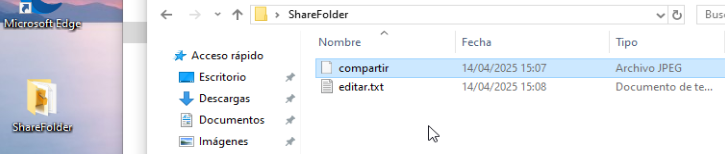


1. **Creación de usuarios**

Para poder hacer pruebas vamos a crear tres usuarios, los cuales tendrán diferentes permisos sobre la carpeta compartida.

- User1: Usuario1
- User2: Usuario2
- User3: Usuario3

Iremos a:

```
Administrador de equipos > Usuarios y grupos locales > Usuarios

Clic derecho > Usuario Nuevo
```

 


1. **Compartir la carpeta**

Ahora que tenemos la carpeta y los usuarios creados, vamos a compartir la carpeta y les asignaremos los siguientes permisos a los usuarios que hemos creado sobre la carpeta que vamos a compartir.

- User1: Usuario1
    - Lectura y escritura
- User2: Usuario2
    - Solo lectura
- User3: Usuario3
    - Denegaremos el acceso

Haremos lo siguiente en la carpeta

```
Clic derecho > Propiedades > Compartir > Uso compartido avanzado > Compartir esta carpeta

Clic derecho > Propiedades > Seguridad > Editar > Agregar
```


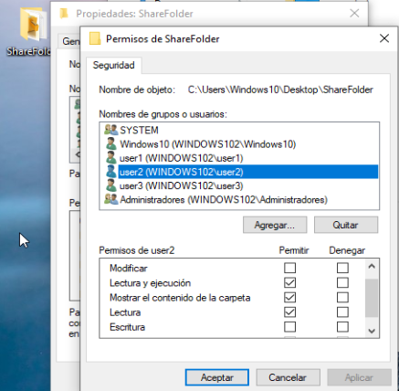


1. **Configuración del escritorio remoto**

En el equipo `Windows102` entraremos en `Ajustes > Sistema > Acerca de > Configuración Avanzada del sistema >  Acceso Remoto`, activaremos el acceso remoto y especificaremos que solo podremos acceder si nos logeamos desde los usuario `user1`, `user2` y `user3`


1. **Comprobar el funcionamiento**

Vamos a comprobar que funciona de diferentes formas, usando el escritorio remoto desde el equipo de `Windows101` nos logearemos con los 3 usuarios, desde el equipo `Windows101` intentaremos acceder a la carpeta y desde el propio equipo `Windoiws102` nos logearemos con los 3 usuarios.


```
Explorador de archivos > Red > \\172.16.10.60
```
Donde:

  - **\ \172.16.10.60** --> es la dirección IP del equipo donde se encuentra a carpeta compartida


**Desde el equipo de Windows102**

*User1*

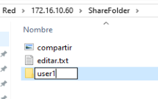

*User2*


*User3*


**Desde el escritorio remoto del equipo de Windows101**

*User1*

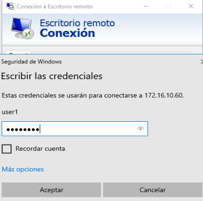


*User2*

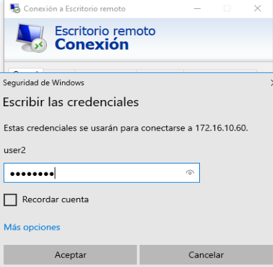


*User3*

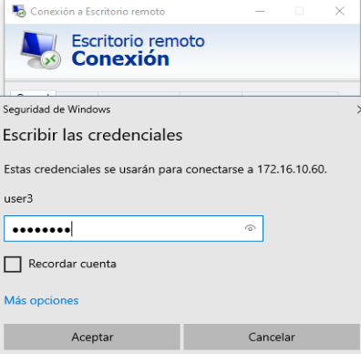


**Desde el equipo de Windows101**


