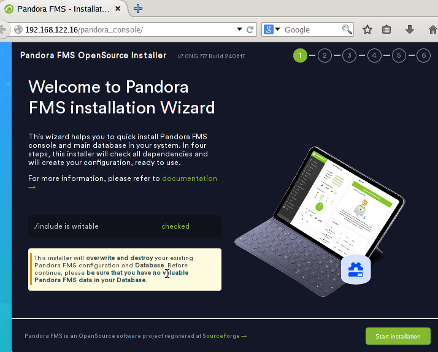

# Projecte Final: Monitorización de Red y Servicios con Pandora FMS en GNS3

## Estructura del Escenario en GNS3

### Dispositivos y Red
- **NAT**: Conectat a Internet i al servidor DHCP.
- **Ubuntu Server (Servidor DHCP)**:
- Monitorizar cin el Pandora FMS

- **Routers**
- Cisco
- Asignar direcciones IP:
- **Xarxa 1**: `192.168.10.0/24` (primer switch).
- Mikrotik
- Asignar direcciones IP:
- **Xarxa 2**: `172.16.10.0/24` (segon switch).

- **Switch 1**:
- Dispositivos conectados:
- Firefox (IP asignada por DHCP).
- VPC (IP asignada por DHCP).
- Ubuntu Desktop (IP reservada: `192.168.10.50`, servidor web).
- Windows 10 (IP reservada: `192.168.10.60`, servicio de archivos).

- **Switch 2**:
- Dispositivos conectados:
- Firefox (IP asignada por DHCP).
- VPC (IP asignada por DHCP).
- Ubuntu Desktop (IP reservada: `172.16.10.50`, servidor MySQL).
- Windows 10 (IP reservada: `172.16.10.60`, servicio de archivos).

<!-- foto de la estructura -->

-------------------------------------------------------------------------------------

## Configuración del Ubuntu Server

### **Configuración del netplan**
```
sudo nano /etc/netplan/50-cloud-init.yaml
sudo netplan apply
```

### **Configuración de Pandora FMS**

1. **Instalación de depenencias:**
- apache2
- mariaDB
- php

```
sudo apt install apache2 mariadb-server mariadb-client php
```

2. **Configuración de mariaDB**

Hay que tener en cuenta que vamos a acceder desde una máquina diferente al server,por lo que tenenmos que editar el archivo de configuración

Buscaremos la linea de `bind-address` y le pondremos `0.0.0.0`
```
sudo nano /etc/mysql/mariadb.conf.d/50-server.cnf

bind-address: 0.0.0.0
```

3. **Creación de la base de datos y el usuario**

Vamos a crear la base de datos y el usuario con el cuál accederemos desde el cliente

```
sudo mysql -u root -p

CREATE DATABASE pandora;
CREATE USER 'pandora'@'%' IDENTIFIED BY 'tu_password_segura';
GRANT ALL PRIVILEGES ON pandora.* TO 'pandora'@'%';
FLUSH PRIVILEGES;
EXIT;
```

4. **Descarga e instalación de Pandora FMS**

Para ello he clonado el repositorio que github de pandora y dado permisos a este

```
git clone https://github.com/pandorafms/pandorafms.git
sudo mv pandorafms/pandora_console /var/www/html/pandora_console

sudo chown -R www-data:www-data /var/www/html/pandora_console
sudo chmod -R 755 /var/www/html/pandora_console
```

5. **Configuración de Apache**

Para ello creamos y editamos el archivo de configuración y lo habilitamos

```
sudo cp 000-default.conf pandora.conf
sudo nano pandora.conf

sudo a2ensite pandira.conf
sudo systemctl reload apache2
sudo systemctl restart apache2
sudo systemctl status apache2
```
6. **Finalizar instalacion en el navegador**

Una vez hecha la instalación y configuración de apache, podremos acceder a través de un navegador buscando lo siguiente:

```
http://192.168.122.16/pandora_console
```

Teniendo en cuenta que la dirección `192.168.122.16` es la ip del servidor y `pandora_console` la carpeta que hemos movido a `/var/www/html`



Una vez dentro simplemente seguimos los pasos de la instalación, nos indicará si hay alguna dependencia que no esté instalada.


Y nos preguntará acerca de los datos de la base de datos.


Cuando encuentre la base de datos se instalará


7. **Instalación y configuración del serrvidor de Pandora FMS**
